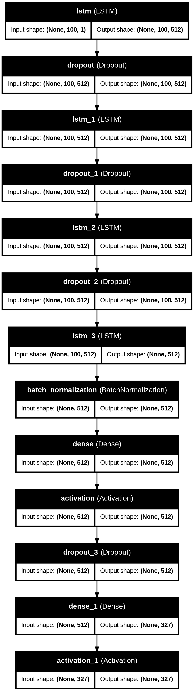

# 🎵 MusicAI - AI-Powered Music Generation

MusicAI is a deep learning project that generates classical-style music using MIDI files as input.  
It leverages an LSTM-based neural network to learn musical patterns and compose new melodies.

---

## 📂 Dataset

The model is trained on the **Classical Music MIDI Dataset** from Kaggle:  
[Classical Music MIDI Dataset](https://www.kaggle.com/datasets/soumikrakshit/classical-music-midi)

---

## 🧠 Model Architecture

The architecture is based on stacked **LSTM layers** with batch normalization and dropout regularization.  
It predicts the next musical note or chord sequence in a melody.

<p align="center">
  
</p>

---

## ⚙️ Requirements

To run this project, install the following dependencies:

```bash
pip install numpy music21 tensorflow keras
```

Optional (for converting MIDI to audio):

```bash
pip install midi2audio
```

---

## 🚀 How It Works

1. **Data Preprocessing:**  
   - Parse MIDI files using `music21`.  
   - Extract notes and chords as sequences.  
   - Convert them into integer-encoded inputs for the model.

2. **Model Training:**  
   - Use an LSTM-based architecture with dropout and batch normalization.  
   - The model predicts the next note in a sequence.  
   - Best model weights are saved using `ModelCheckpoint`.

3. **Music Generation:**  
   - Generate new sequences by feeding a seed pattern.  
   - Convert the generated notes back into a MIDI file.  
   - Optionally, use `midi2audio` or `FluidSynth` to render to `.wav`.

---

## 🧩 Technologies Used

- Python  
- TensorFlow / Keras  
- Music21  
- NumPy  
- IPython (for audio playback)

---

## 📈 Future Improvements

- Experiment with Transformer-based architectures for better sequence learning.  
- Include user-defined style conditioning (e.g., Mozart, Beethoven).  
- Add a web UI for generating custom melodies.

---

## 🖋️ Author

**Sarthak Jain**  
📧 [sarthakjain144@gmail.com ](sarthakjain144@gmail.com) 
🌐 [https://github.com/sarthak-144](https://github.com/sarthak-144)


---

## 📜 License

This project is licensed under the **MIT License** – feel free to use, modify, and share it.

---

